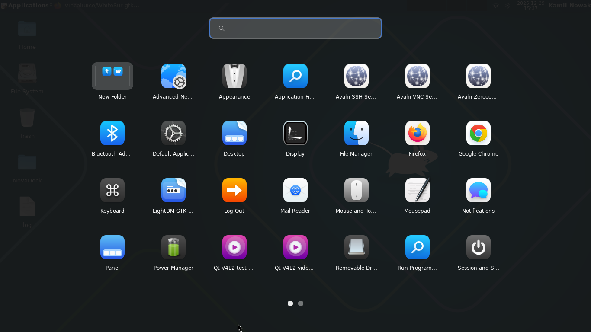
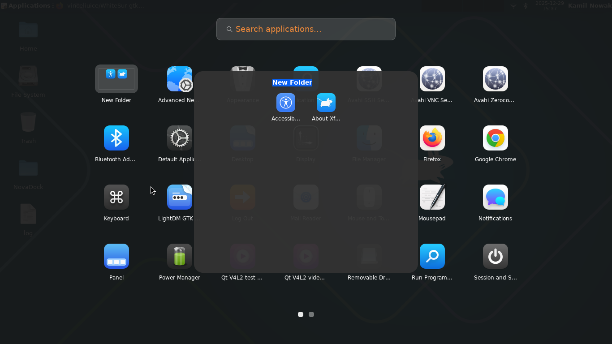

[](https://ko-fi.com/novadesktop)
# NovaDock

A macOS/GNOME-style dock and application launcher for XFCE4.

<p align="center">
  
</p>

<p align="center">
  
  
</p>

## Features

- **Dock Panel** - Animated dock with macOS-style magnification effect
- **Application Launcher** - Full-screen launchpad with grid view and search
- **Pin/Unpin Apps** - Right-click to pin running apps or unpin favorites
- **App Indicators** - Visual indicators for running applications
- **Multi-Instance Support** - Right-click → "Open New Window" for running apps
- **Plugin System** - Extensible architecture for custom dock plugins
- **Theme Support** - Installable themes for dock customization
- **Settings Panel** - Configure dock position, size, behavior, and appearance

## Technology Stack

- **Language:** Vala
- **UI Toolkit:** GTK3
- **Build System:** Meson
- **Target DE:** XFCE4

## Requirements

- GTK+ 3.0
- libwnck 3.0 (window management)
- GLib 2.0
- Vala compiler (valac)
- Meson & Ninja
- gtk-layer-shell (optional, for Wayland support)

## Building

```bash
meson setup build
cd build
ninja
sudo ninja install
```

## Installation from Packages

Pre-built packages are available on the [Releases](https://github.com/novik133/NovaDock/releases) page.

### Import GPG Key

All packages are signed with GPG key `8419D50A73686C21`. Import the key before installing:

```bash
# Download the public key
gpg --keyserver keyserver.ubuntu.com --recv-keys 8419D50A73686C21
```

### Debian/Ubuntu

```bash
# Import key for APT
gpg --keyserver keyserver.ubuntu.com --recv-keys 8419D50A73686C21
gpg --export 8419D50A73686C21 | sudo tee /usr/share/keyrings/novadock.gpg > /dev/null

# Verify and install package
gpg --verify novadock_0.1.3_amd64.deb.asc novadock_0.1.3_amd64.deb
sudo dpkg -i novadock_0.1.3_amd64.deb
```

### Fedora/RHEL

```bash
# Import key for RPM
gpg --keyserver keyserver.ubuntu.com --recv-keys 8419D50A73686C21
gpg --export --armor 8419D50A73686C21 | sudo tee /etc/pki/rpm-gpg/RPM-GPG-KEY-novadock > /dev/null
sudo rpm --import /etc/pki/rpm-gpg/RPM-GPG-KEY-novadock

# Verify and install package
gpg --verify novadock-0.1.3-1.x86_64.rpm.asc novadock-0.1.3-1.x86_64.rpm
sudo dnf install ./novadock-0.1.3-1.x86_64.rpm
```

### Arch Linux

```bash
# Import key for pacman
gpg --keyserver keyserver.ubuntu.com --recv-keys 8419D50A73686C21
sudo pacman-key --add <(gpg --export 8419D50A73686C21)
sudo pacman-key --lsign-key 8419D50A73686C21

# Verify and install package
gpg --verify novadock-0.1.3-1-x86_64.pkg.tar.zst.asc novadock-0.1.3-1-x86_64.pkg.tar.zst
sudo pacman -U novadock-0.1.3-1-x86_64.pkg.tar.zst
```

## Project Structure

```
NovaDock/
├── lib/                # Library (libnovadock)
│   ├── core/           # Application core
│   ├── dock/           # Dock panel components
│   ├── launcher/       # Full-screen app launcher
│   ├── plugins/        # Plugin system & built-in plugins
│   ├── settings/       # Settings UI
│   ├── themes/         # Theme system
│   └── meson.build
├── src/
│   ├── main.vala       # Entry point
│   └── meson.build
├── data/
│   ├── themes/         # Default themes
│   ├── icons/          # Dock icons
│   └── novadock.desktop
├── docs/               # Documentation
└── meson.build
```

## Usage

```bash
novadock              # Start dock
novadock --launcher   # Open launcher only
novadock --settings   # Open settings
```

## Customization

- [Creating Custom Themes](docs/THEMES.md) - Customize dock colors, transparency, and style
- [Creating Custom Plugins](docs/PLUGINS.md) - Add custom buttons and functionality to the dock

## License

GPL-3.0
